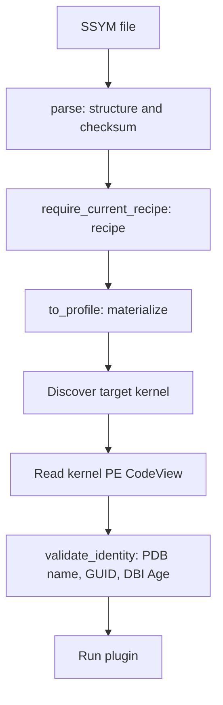

# SSYM v1: Binary Structure and Reader Contract

[中文](FORMAT.md) · **English** · [Project home](README.en.md)

This document describes the measured implementation, based on the [codec](reference/src/profile/compiled.rs)
and [boundary tests](reference/src/profile/compiled/tests.rs). It records the current binary contract,
not a general standard for full ISF. The format version is `1` and the extension is `.ssym`.

## 1. Semantic scope

SSYM preserves the current `KernelProfile`: profile schema, PDB GUID/Info Age, root type name and size,
root fields, types and their fields, and global symbol RVAs. Fields contain an offset, optional size,
optional bit position, and optional bit length. The independent root field map is not merged with
a same-named type. `None` and `Some(0)` remain distinct. No 64-bit integer passes through floating point.

The header additionally records the PDB filename, source hash, original DBI Age, and extraction recipe hash.
The projection does not represent the full ISF graph of base types, enums, pointers, arrays, functions,
aliases, or cross-module references. Linux ISF and other module PDBs, including tcpip/win32k, are not migrated.

## 2. Encoding and overall layout

- All integers are unsigned **little endian**. Offsets and lengths are in bytes.
- There are no native pointers or Rust memory layouts. Records are packed without alignment padding.
- Maximum file size is **64 MiB**, with a **192-byte** header. This is a file limit, not a process memory limit.
- Names are UTF-8 byte strings referenced by a pool-relative offset and byte length, without NUL termination.
- This version has no compressed sections, extension directory, mmap reader, or general type-ID graph.

The monospace diagrams are schematic, not drawn to byte scale. Offsets and tables define exact positions.

```text
File offset
0                 192            B_fields          B_symbols        B_strings            EOF
|------------------|-----------------|-----------------|-----------------|-----------------|
| Header           | Type records    | Field records   | Symbol records  | UTF-8 pool      |
| 192 bytes        | T * 24 bytes    | F * 32 bytes    | S * 16 bytes    | W bytes         |
|------------------|-----------------|-----------------|-----------------|-----------------|
```

Let `R/T/F/S/W` denote root field count, type count, total field count, symbol count, and string pool bytes:

```text
B_types   = 192
B_fields  = B_types   + T * 24
B_symbols = B_fields  + F * 32
B_strings = B_symbols + S * 16
file_len  = B_strings + W
F         = R + sum(type.field_count)
```

Check every multiplication and addition for overflow and file bounds. Do not trust counts before
allocating an object tree. There is no extra trailing data: the computed end must equal the actual file size.

## 3. Header: 192 bytes

Names below are descriptive specification labels for the corresponding byte positions in the codec.

| Offset | Bytes | Type / field | Meaning |
| ---: | ---: | --- | --- |
| 0 | 8 | `magic` | `53 53 59 4D 0D 0A 1A 0A`, or `SSYM\r\n\x1a\n` |
| 8 | 4 | `u32 format_version` | Must be 1 |
| 12 | 4 | `u32 header_len` | Must be 192 |
| 16 | 8 | `u64 file_len` | Must equal the actual file size |
| 24 | 4 | `u32 profile_schema` | Original model schema, distinct from the disk format version |
| 28 | 4 | `u32 pdb_info_age` | Preserves the original profile's PDB Info Age |
| 32 | 8 | `NameRef pdb_guid` | GUID as text |
| 40 | 8 | `NameRef root_type_name` | Root type name |
| 48 | 8 | `u64 root_type_size` | Root type size |
| 56 | 4 | `u32 root_field_count` | R, root field count |
| 60 | 4 | `u32 type_count` | T, type count |
| 64 | 4 | `u32 field_count` | F, total fields including root fields |
| 68 | 4 | `u32 symbol_count` | S, symbol count |
| 72 | 4 | `u32 string_bytes` | W, string pool length |
| 76 | 4 | `u32 reserved` | Must be zero |
| 80 | 32 | `pdb_sha256` | SHA-256 of all source PDB bytes |
| 112 | 32 | `recipe_sha256` | SHA-256 of the build-time raw bytes of `profile.rs` |
| 144 | 32 | `file_sha256` | Hash of the file excluding this field |
| 176 | 8 | `NameRef pdb_name` | PDB filename, without a path |
| 184 | 4 | `u32 pdb_dbi_age` | Original DBI Age for exact image matching |
| 188 | 4 | `u32 reserved` | Must be zero |

Hashes are raw 32-byte values, not 64-character hexadecimal strings. The GUID references UTF-8 text
and does not use the mixed byte order of a Windows GUID struct. The decoder preserves `profile_schema`
without separately requiring a particular known schema value. Format-version validation is not
validation of the profile's semantics.

## 4. Name references and string pool

```text
NameRef (8 bytes)
relative offset   +0                   +4                   +8
                  |--------------------|--------------------|
                  | pool_offset: u32   | byte_length: u32   |
                  |--------------------|--------------------|

name = file[B_strings + pool_offset : B_strings + pool_offset + byte_length]
```

Each referenced range must be inside the string pool and its slice must be valid UTF-8.
Length counts bytes, not Unicode characters. The encoder deduplicates exact strings and appends them
on first insertion; the pool itself need not be lexicographically sorted. The decoder does not require
unique references or every pool byte to be referenced. It checks referenced slices and makes no
additional semantic guarantee about unused bytes.

Type records, symbol records, and each field group are sorted by name. Ordering is strictly increasing
lexicographic UTF-8 byte order, so duplicate names within a group are rejected. Name lookup is case-sensitive;
PDB filename identity matching separately uses ASCII case-insensitive comparison.

## 5. Three record types

### Type record: 24 bytes

```text
+0                 +8                  +16         +20         +24
| name: NameRef     | size: u64         | first:u32 | count:u32 |
```

| Relative offset | Bytes | Field | Meaning |
| ---: | ---: | --- | --- |
| 0 | 8 | `name` | Type name reference |
| 8 | 8 | `size` | Type size in bytes |
| 16 | 4 | `first_field` | Zero-based index into the global field table, not a byte offset |
| 20 | 4 | `field_count` | Number of consecutive field records owned by this type |

### Field record: 32 bytes

```text
+0             +8             +16            +24        +28  +29  +30     +32
| name:NameRef  | offset:u64   | size:u64      | flags:u32 | pos | len | zero  |
```

| Relative offset | Bytes | Field | Meaning |
| ---: | ---: | --- | --- |
| 0 | 8 | `name` | Field name reference |
| 8 | 8 | `offset` | Byte offset relative to the owning structure |
| 16 | 8 | `size` | Value slot for optional byte size |
| 24 | 4 | `flags` | Presence bits for optional values |
| 28 | 1 | `bit_position` | Value slot for optional bit position |
| 29 | 1 | `bit_length` | Value slot for optional bit length |
| 30 | 2 | `reserved` | Must be all zero |

Bits 0 / 1 / 2 of `flags` mean that `size` / `bit_position` / `bit_length` is present. All other bits must
be zero. An absent value slot must be zero; a present zero value represents `Some(0)`.
The optionality of bit position and bit length is preserved independently. The parser does not
additionally prove that bit ranges fit the owning type's size.

### Symbol record: 16 bytes

```text
+0                       +8                 +12                +16
| name: NameRef           | rva: u32          | reserved: u32     |
```

| Relative offset | Bytes | Field | Meaning |
| ---: | ---: | --- | --- |
| 0 | 8 | `name` | Global symbol name reference |
| 8 | 4 | `rva` | Module-relative virtual address, retaining the model's u32 range |
| 12 | 4 | `reserved` | Must be zero |

An RVA is neither an image-file offset nor a physical address. The runtime module base comes from
the target image and is not stored in this record.

## 6. Field ownership and indexed lookup

```text
Global field table
0                R                 R + count(type[0])                 F
|----------------|--------------------------|-------------------------|
| Root fields    | Fields of type[0]        | Fields of type[1] ...   |
|----------------|--------------------------|-------------------------|
                 ^                         ^
                 type[0].first_field       type[1].first_field
```

Root fields occupy `[0, R)`. Type-owned fields follow consecutively in type-table order.
Empty groups are permitted; overlaps, gaps, and unowned records are rejected. Groups are individually
sorted, but the global field table need not be sorted across groups. Same-named root and type fields
remain separate records; only their name strings may be reused.

`type_field(type, field)` binary-searches the type table, then that type's field slice;
`symbol_rva(name)` binary-searches the symbol table. Comparison counts are `O(log T + log K)`
and `O(log S)`, where K is the type's field count. String comparison and UTF-8 processing add costs.
This is not a constant-time lookup guarantee.

## 7. Integrity, recipe, and kernel identity

```text
file_sha256 = SHA256(file[0:144] || file[176:file_len])
```

The checksum field is excluded, not zero-filled before hashing the whole file. Coverage includes
the rest of the header, every table, and every pool byte. The codec's `parse()` checks:

1. Length limits, magic, format version, header length, declared length, and header reserved values.
2. The complete checksum and `0 < pdb_dbi_age <= pdb_info_age`.
3. Table bounds and count overflow, root field range, contiguous field ownership, and the exact file end.
4. UTF-8 name slices, ordering, GUID normalization, and a nonempty PDB filename without `/`, `\`, `:`, or NUL.
5. Field flags, absent-value slots, and field/symbol reserved values.

GUID comparison removes `-` and converts ASCII letters to uppercase; the result must contain
32 hexadecimal characters. Post-processing can increase PDB Info Age. Exact matching against the
image's CodeView record instead uses original DBI Age. The measured Info Ages were 4 / 2 / 6,
while all DBI/image Ages were 1. See the [pdb crate's Age semantics](https://docs.rs/pdb/0.8.0/pdb/struct.DebugInformation.html#method.age).

This is the **implemented StarMem session order**, not an implicit guarantee of every low-level API:



Failure at any stage returns an error. This experimental entry rejects x86 PAE.
The compatibility path materializes the profile and discovers the kernel before binding it to the
actual kernel PE identity; it does not merely match an arbitrary RSDS string in physical memory.
`CompiledProfileFile::open()` performs structural validation only. The caller explicitly checks
the recipe and target identity.

The three hashes serve different purposes: `file_sha256` detects corruption, `pdb_sha256` records
provenance, and `recipe_sha256` rejects an outdated extraction recipe. They are not digital signatures
and do not authenticate third-party symbols. Loading does not reopen the source PDB to verify its hash.
The recipe currently covers only the raw bytes of `profile.rs`, not every dependency; changing line
endings also changes the recipe.

## 8. Worked layout example: synthetic, not forensic output

Use `R=1, T=1, F=2, S=1`. The root type and the only type are both `_DEMO`, with one `Id` field in each group.
The GUID is `00112233-4455-6677-8899-AABBCCDDEEFF`, the filename is `demo.pdb`, and the symbol is `DemoHead`.
Following the current encoder's first-insertion order gives:

| Pool offset | Bytes | Content |
| ---: | ---: | --- |
| 0 | 36 | `00112233-4455-6677-8899-AABBCCDDEEFF` |
| 36 | 5 | `_DEMO` |
| 41 | 8 | `demo.pdb` |
| 49 | 2 | `Id` |
| 51 | 8 | `DemoHead` |

Thus `B_fields=216`, `B_symbols=280`, `B_strings=296`, `W=59`, and file size is `355` bytes.
The type record has `first_field=1`; the two field records belong to the root and type groups separately.
The NameRef for `Id` is `31 00 00 00 02 00 00 00`, locating its text at file range `[345, 347)`.
A complete file also needs valid header values and a real checksum. This layout illustration is not
a directly loadable binary fixture.

## 9. Production, use, and version boundaries

Compilation checks that the source PDB hash is unchanged across extraction, extracts the profile
and DBI Age, encodes, and validates using the same parser. The CLI uses existing `OutputPolicy`
atomic output and input protection. Commands are in [Reproduction](REPRODUCE.en.md).

The reader currently loads a bounded `Vec`. Validation touches at least every file byte; it uses
no mmap and does not provide O(1) opening. `to_profile()` allocates ordinary strings and BTreeMaps;
its peak also includes the temporary file buffer. Structural validation does not establish correct
field semantics, complete target memory, or the authenticity of recovered evidence.

The decoder rejects other format versions and header lengths other than 192 bytes. It does not
silently accept future extensions. New type graphs, compressed sections, 64-bit RVAs, or reference
layouts require separate design and versioning; they are not implemented v1 capabilities.
