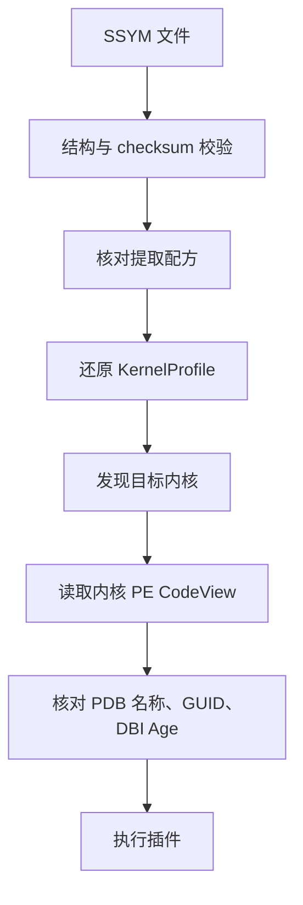

# SSYM v1 格式结构与读取约定

**中文** · [English](FORMAT.en.md) · [项目首页](README.md)

本文描述本研究实测版本，依据 [编码与解码实现](reference/src/profile/compiled.rs)
及 [边界测试](reference/src/profile/compiled/tests.rs)。它记录当前二进制约定，
不是完整 ISF 的通用标准。格式版本为 `1`，扩展名为 `.ssym`。

## 1. 语义范围

SSYM 无损保存当前 `KernelProfile`：profile schema、PDB GUID/Info Age、根类型名与大小、
根字段、各类型及字段、全局符号 RVA。每个字段包含偏移、可选大小、可选位位置与位长度。
独立根字段表不合并到同名类型中；`None` 与 `Some(0)` 不合并；64 位整数不经过浮点数。

头部额外记录 PDB 文件名、源文件哈希、DBI 原始 Age 和提取配方哈希。
完整 ISF 的基础类型图、枚举、指针、数组、函数、别名及跨模块引用不在当前投影中。
Linux ISF、tcpip/win32k 等其他模块 PDB 未迁移。

## 2. 编码规则与整体布局

- 所有整数为无符号 **little endian**，偏移与长度单位为字节。
- 文件不包含原生指针或 Rust 内存布局；记录紧密排列，不插入对齐填充。
- 文件上限为 **64 MiB**，头长 **192 字节**。这是文件限制，不是进程内存上限。
- 名称为 UTF-8 字节串；引用保存相对字符串池的偏移与字节长度，不依赖 NUL 结尾。
- 本版没有压缩段、扩展段目录、mmap 或通用类型 ID 图。

下列等宽图用于说明关系，不按字节比例绘制；精确位置以偏移和表格为准。

```text
File offset
0                 192            B_fields          B_symbols        B_strings            EOF
|------------------|-----------------|-----------------|-----------------|-----------------|
| Header           | Type records    | Field records   | Symbol records  | UTF-8 pool      |
| 192 bytes        | T * 24 bytes    | F * 32 bytes    | S * 16 bytes    | W bytes         |
|------------------|-----------------|-----------------|-----------------|-----------------|
```

令 `R/T/F/S/W` 分别为根字段数、类型数、总字段数、符号数、字符串池字节数：

```text
B_types   = 192
B_fields  = B_types   + T * 24
B_symbols = B_fields  + F * 32
B_strings = B_symbols + S * 16
file_len  = B_strings + W
F         = R + sum(type.field_count)
```

每次乘加必须检查溢出和文件范围，不能先信任文件里的计数再分配对象树。
没有额外尾部数据；计算出的结束位置必须等于实际文件长度。

## 3. 文件头：192 字节

下表字段名是规范中的说明名称，对应源码的相同字节位置。

| 偏移 | 字节数 | 类型 / 字段 | 含义 |
| ---: | ---: | --- | --- |
| 0 | 8 | `magic` | `53 53 59 4D 0D 0A 1A 0A`，即 `SSYM\r\n\x1a\n` |
| 8 | 4 | `u32 format_version` | 必须为 1 |
| 12 | 4 | `u32 header_len` | 必须为 192 |
| 16 | 8 | `u64 file_len` | 必须等于文件实际字节数 |
| 24 | 4 | `u32 profile_schema` | 保存原模型 schema；不是磁盘格式版本 |
| 28 | 4 | `u32 pdb_info_age` | 保留原模型的 PDB Info Age |
| 32 | 8 | `NameRef pdb_guid` | 字符串形式的 GUID |
| 40 | 8 | `NameRef root_type_name` | 根类型名称 |
| 48 | 8 | `u64 root_type_size` | 根类型大小 |
| 56 | 4 | `u32 root_field_count` | R，根字段数 |
| 60 | 4 | `u32 type_count` | T，类型数 |
| 64 | 4 | `u32 field_count` | F，包含根字段的总字段数 |
| 68 | 4 | `u32 symbol_count` | S，符号数 |
| 72 | 4 | `u32 string_bytes` | W，字符串池长度 |
| 76 | 4 | `u32 reserved` | 必须为零 |
| 80 | 32 | `pdb_sha256` | 源 PDB 全部字节的 SHA-256 |
| 112 | 32 | `recipe_sha256` | 构建时 `profile.rs` 原始字节的 SHA-256 |
| 144 | 32 | `file_sha256` | 除本字段以外的文件字节校验和 |
| 176 | 8 | `NameRef pdb_name` | PDB 文件名，不含路径 |
| 184 | 4 | `u32 pdb_dbi_age` | DBI 原始 Age，用于精确匹配镜像 |
| 188 | 4 | `u32 reserved` | 必须为零 |

哈希均存储为原始 32 字节，不是 64 字符十六进制文本。GUID 则通过 `NameRef` 引用 UTF-8 文本，
不使用 Windows GUID 结构体的混合字节序。当前解码器原样保留 `profile_schema`，
并未单独强制它等于某个已知 schema；不要把格式版本校验误写成 profile 语义校验。

## 4. 名称引用与字符串池

```text
NameRef (8 bytes)
relative offset   +0                   +4                   +8
                  |--------------------|--------------------|
                  | pool_offset: u32   | byte_length: u32   |
                  |--------------------|--------------------|

name = file[B_strings + pool_offset : B_strings + pool_offset + byte_length]
```

被引用的范围必须落在字符串池内，且该切片必须是有效 UTF-8。
长度按字节计数，不能当作 Unicode 字符数。编码器按精确字符串内容去重，并按首次插入顺序排池，
字符串池本身不要求字典序。解码器不要求不同引用唯一，也不要求每个池字节都被引用；
它逐个检查被引用的切片，不对未引用字节承诺额外语义。

按名称排序的是类型记录、符号记录和每组字段记录。排序依据为 UTF-8 字节的字典序，
严格递增，同一组内不能有重名记录。名称查找区分大小写；PDB 文件名身份比较另用 ASCII 大小写忽略规则。

## 5. 三类记录

### 类型记录：24 字节

```text
+0                 +8                  +16         +20         +24
| name: NameRef     | size: u64         | first:u32 | count:u32 |
```

| 相对偏移 | 字节数 | 字段 | 含义 |
| ---: | ---: | --- | --- |
| 0 | 8 | `name` | 类型名称引用 |
| 8 | 8 | `size` | 类型字节大小 |
| 16 | 4 | `first_field` | 全局字段表中的零基索引，不是字节偏移 |
| 20 | 4 | `field_count` | 此类型的连续字段记录数 |

### 字段记录：32 字节

```text
+0             +8             +16            +24        +28  +29  +30     +32
| name:NameRef  | offset:u64   | size:u64      | flags:u32 | pos | len | zero  |
```

| 相对偏移 | 字节数 | 字段 | 含义 |
| ---: | ---: | --- | --- |
| 0 | 8 | `name` | 字段名称引用 |
| 8 | 8 | `offset` | 字段相对所属结构的字节偏移 |
| 16 | 8 | `size` | 可选字节大小的数值槽 |
| 24 | 4 | `flags` | 可选值的存在标志 |
| 28 | 1 | `bit_position` | 可选位位置的数值槽 |
| 29 | 1 | `bit_length` | 可选位长度的数值槽 |
| 30 | 2 | `reserved` | 必须全零 |

`flags` 的 bit 0 / 1 / 2 分别表示 `size` / `bit_position` / `bit_length` 存在，其他位必须为零。
不存在的数值槽必须为零；标志存在且数值为零表示 `Some(0)`。
位位置和位长度各自独立保留可选性。当前解析器不额外证明位范围符合所属类型大小。

### 符号记录：16 字节

```text
+0                       +8                 +12                +16
| name: NameRef           | rva: u32          | reserved: u32     |
```

| 相对偏移 | 字节数 | 字段 | 含义 |
| ---: | ---: | --- | --- |
| 0 | 8 | `name` | 全局符号名称引用 |
| 8 | 4 | `rva` | 模块相对虚拟地址，保留现有模型的 u32 范围 |
| 12 | 4 | `reserved` | 必须为零 |

RVA 不是镜像文件偏移或物理地址；运行时模块基址来自目标镜像，不存入该记录。

## 6. 字段归属与索引查询

```text
Global field table
0                R                 R + count(type[0])                 F
|----------------|--------------------------|-------------------------|
| Root fields    | Fields of type[0]        | Fields of type[1] ...   |
|----------------|--------------------------|-------------------------|
                 ^                         ^
                 type[0].first_field       type[1].first_field
```

根字段占 `[0, R)`。随后按类型表顺序连续排列每个类型的字段，允许空组，
但不允许重叠、跳过记录或留下无归属字段。各组分别排序，整个字段表不要求全局按名称排序。
根字段与类型字段即使同名也分别存储，编码器只复用名称字符串。

`type_field(type, field)` 先二分类型表，再二分该类型字段切片；`symbol_rva(name)` 二分符号表。
比较次数分别为 `O(log T + log K)` 和 `O(log S)`，K 为该类型字段数；
字符串比较与 UTF-8 处理另有成本。这不是常数时间查询承诺。

## 7. 完整性、配方与内核身份

```text
file_sha256 = SHA256(file[0:144] || file[176:file_len])
```

checksum 字段被排除，而不是先补零再整体计算。校验覆盖其余头部、所有表与全部字符串池字节。
源码中的 `parse()` 完成以下结构检查：

1. 文件长度范围、magic、格式版本、头长、声明长度及头部保留值。
2. 完整 checksum；`0 < pdb_dbi_age <= pdb_info_age`。
3. 表边界与计数溢出、根字段范围、字段连续归属及文件精确结束位置。
4. 名称切片 UTF-8、排序、GUID 规范化，以及 PDB 文件名非空且不含 `/`、`\`、`:`、NUL。
5. 字段标志、缺省数值槽、字段与符号保留值。

GUID 比较先去掉 `-` 并转为 ASCII 大写，结果必须是 32 个十六进制字符。
PDB Info Age 可能由后处理递增；与镜像 CodeView 精确比较的是 DBI 原始 Age。
本次样本 Info Age 为 4 / 2 / 6，DBI 与镜像 Age 均为 1。
此区分见 [pdb crate 的 Age 语义](https://docs.rs/pdb/0.8.0/pdb/struct.DebugInformation.html#method.age)。

下面是**已接入 StarMem 会话的顺序**，不是所有低层 API 的隐含行为：



图中任一阶段失败即返回错误；x86 PAE 在本实验入口被拒绝。当前兼容路径先还原模型并发现内核，
再绑定到实际内核 PE 身份，并非仅匹配物理内存中任意一段 RSDS 字符串。
`CompiledProfileFile::open()` 本身只做结构校验；配方和目标身份由调用方显式检查。

三个哈希目的不同：`file_sha256` 检测损坏，`pdb_sha256` 记录来源，`recipe_sha256` 拒绝提取配方过期。
它们不是数字签名，不能证明第三方符号可信。加载时没有重新打开原 PDB 核对来源哈希。
配方目前只覆盖 `profile.rs` 原始字节，不代表全部依赖；换行变化也会使配方变化。

## 8. 布局示例（人工构造，非取证结果）

取 `R=1, T=1, F=2, S=1`，根类型与唯一类型均为 `_DEMO`，两组各含一个 `Id` 字段。
GUID 为 `00112233-4455-6677-8899-AABBCCDDEEFF`，文件名为 `demo.pdb`，符号名为 `DemoHead`。
遵循当前编码器的首次插入顺序，字符串池为：

| 池内偏移 | 字节数 | 内容 |
| ---: | ---: | --- |
| 0 | 36 | `00112233-4455-6677-8899-AABBCCDDEEFF` |
| 36 | 5 | `_DEMO` |
| 41 | 8 | `demo.pdb` |
| 49 | 2 | `Id` |
| 51 | 8 | `DemoHead` |

因此 `B_fields=216`，`B_symbols=280`，`B_strings=296`，`W=59`，文件长为 `355` 字节。
类型记录的 `first_field=1`；两条字段记录分别属于根字段与类型字段。
`Id` 的 NameRef 编码为 `31 00 00 00 02 00 00 00`，实际名称位于文件 `[345, 347)`。
完整文件还需要合法头值和实际 checksum；此布局示例不是可直接加载的字节夹具。

## 9. 生成、使用与版本边界

生成路径先检查源 PDB 在提取前后哈希一致，提取 profile 和 DBI Age，再编码并调用同一解析器校验。
CLI 使用现有 `OutputPolicy` 原子写入与输入保护。命令见 [复现指南](REPRODUCE.md)。

当前读取器将文件读入一个有界 `Vec`，校验至少触及全部文件字节；不使用 mmap，不能宣称 O(1) 打开。
`to_profile()` 会分配普通字符串和 BTreeMap，兼容读取的峰值也包含临时文件缓冲区。
结构校验不替代字段语义、目标镜像完整性和恢复证据真实性的复核。

当前解码器拒绝其他格式版本和非 192 字节头长，不会静默接受未来扩展。
新的类型图、压缩段、64 位 RVA 或不同引用布局需另行设计和版本化；它们不属于 v1 的已实现能力。
