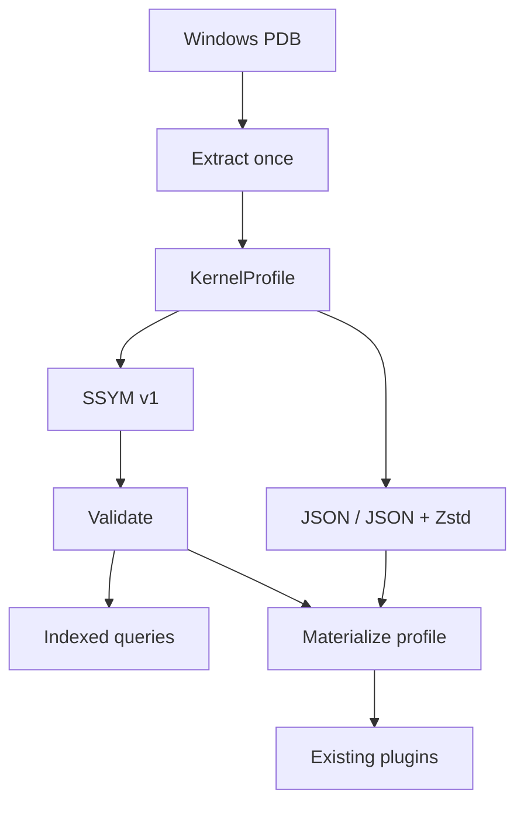

# SSYM: Format and Performance Research for Compiled Forensic Symbols

[中文](README.md) · **English**

> **Project status: StarMem's source code is not public at present. This repository is solely
> a research and validation study of the SSYM format, not a release of the StarMem engine source,
> a standalone StarMem product, or a public SDK.**
> `reference/` contains only excerpts and integration notes relevant to this validation. Readers
> can inspect the format, tools, and statistics and check the published data offline. Full engine
> experiments still require access to private source or a test environment and a valid license.

## Abstract

SSYM (StarMem Symbols) investigates extracting runtime symbol information from a Windows PDB once,
storing it in a verifiable, indexed binary file, and reusing it in subsequent memory analysis.
This repository contains an experimental format, StarMem reference source excerpts, reproducible
measurement tools, and raw statistics. It separates the effects of precompilation, encoding,
and the data structures used at runtime.

Version 1 preserves StarMem's `KernelProfile` projection without loss. It uses fixed-width records,
name-sorted tables, a deduplicated string pool, and SHA-256 integrity checking.
This research prototype does not cover the full ISF type graph or change the engine's default
symbol path. Performance claims apply only to the recorded implementation, images, and measurement boundaries.

## Research questions

| ID | Question | Comparison |
| --- | --- | --- |
| RQ1 | Can precompilation reduce symbol initialization in a new session? | Repeated PDB extraction vs previously generated JSON / SSYM |
| RQ2 | What does binary indexing gain or sacrifice at equal information content? | Loading, allocation, size, and name lookup for the same profile |
| RQ3 | Do stage-level gains improve actual image analysis? | `AnalysisSession::open` + `pslist` on the same image, with report hash checks |
| RQ4 | What separates this projection from full ISF? | Vol3 ISF loading and native pslist from the same PDB, recording coverage and output differences separately |



The two SSYM consumption paths are measured separately. Actual StarMem sessions currently use
the materialized profile, so low allocation counts for indexed queries are not benefits already
obtained by every plugin. See [Research design](RESEARCH.en.md) for hypotheses, controls, and proposed experiments.

## Findings at a glance

Experiment date: 2026-10-05; three Windows images of 2 / 4 / approximately 8 GiB.
The table reports median symbol loading time in ms, with warm file caches and 9 samples per entry.

| Method | A | B | C |
| --- | ---: | ---: | ---: |
| Repeated PDB extraction | 4.548 | 13.800 | 13.691 |
| Same-content JSON reader | 0.785 | 1.233 | 1.171 |
| SSYM indexed view | 0.386 | 0.593 | 0.691 |
| SSYM materialized for existing plugins | 0.628 | 1.384 | 0.877 |

Materialized SSYM loading was approximately **7–16 times faster** than repeated PDB extraction,
but did not consistently outperform JSON. The name index reduced allocations while hot lookups
were slower than lookups in an already constructed BTreeMap.
Actual session ranges overlapped for A/B. For C, PDB / JSON / SSYM took
**23.980 / 10.090 / 11.033 ms**, respectively. The evidence supports further work on compiled caches
and session reuse; it does not establish a universal improvement in total forensic analysis time.

Vol3 loading of full ISF JSON from the same PDBs had medians of approximately 178–251 ms.
Its information content and measurement boundaries differ, so these numbers cannot be divided by
the table above to obtain a format speedup. Native pslist returned zero records for A, failed to
initialize for B, and returned 161 records for C, differing from StarMem's 160.
StarMem itself reported completeness warnings for A/C.
The [benchmark report](BENCHMARKS.en.md) retains all ranges, failures, and non-equivalent results.

## Documentation

Every guide has a full Chinese and English version. Data, code identifiers, and original diagnostics
retain their recorded form to support independent checking.

| Topic | 中文 | English |
| --- | --- | --- |
| Research questions, tradeoffs, and experimental plan | [研究设计](RESEARCH.md) | [Research design](RESEARCH.en.md) |
| Header, record layouts, strings, and validation | [格式规范](FORMAT.md) | [Format specification](FORMAT.en.md) |
| Equal-content tests, actual sessions, and Vol3 | [方法与结果](BENCHMARKS.md) | [Methods and results](BENCHMARKS.en.md) |
| Build and reproduction commands | [复现指南](REPRODUCE.md) | [Reproduction](REPRODUCE.en.md) |
| Completed checks and their scope | [验证记录](VALIDATION.md) | [Validation record](VALIDATION.en.md) |
| Raw statistics, units, and provenance | [数据说明](data/README.md) | [Data guide](data/README.en.md) |
| Scripts and execution order | [工具说明](scripts/README.md) | [Tool guide](scripts/README.en.md) |
| Measured source excerpts and integration patch | [参考实现](reference/README.md) | [Reference implementation](reference/README.en.md) |

## Reproduction and status

The publication bundle can be checked offline without images or an engine license. Run from this research directory:

```powershell
python -B -X utf8 scripts/verify-study.py
```

Rerunning engine experiments requires the corresponding private StarMem source or test build, an existing valid
license, and images supplied by the researcher. `reference/` contains reviewable excerpts, not a
standalone buildable crate. This repository excludes raw images, PDBs, complete symbol files,
license files, and recovered process records. Neither StarMem source nor raw images is publicly
distributed with this study. Hashes identify samples; this Git repository alone cannot fully
reproduce the engine experiments.

Status: **experimental format v1 / exploratory single-machine benchmark / Windows x64 kernel projection**.
Full ISF, Linux, other module PDBs, mmap, and plugin field handles remain future work.

## References and license

[Volatility 3's symbol loader](https://volatility3.readthedocs.io/en/latest/_modules/volatility3/framework/symbols/intermed.html)
provides the JSON loading and validation path; [LLVM's PDB TPI/IPI documentation](https://llvm.org/docs/PDB/TpiStream.html)
describes type-indexed debug records. Future experiments may compare
[FlatBuffers](https://flatbuffers.dev/) and [rkyv](https://rkyv.org/) on the same semantic model.
Neither is benchmarked here.

This research distribution uses **Apache-2.0**; see [LICENSE-APACHE](LICENSE-APACHE).
Included StarMem code is distributed under its Apache-2.0 license option. Original package metadata
in the measured source snapshot is preserved for provenance. Vol3 is invoked from a local installation;
its source and third-party symbol data are not redistributed here.
