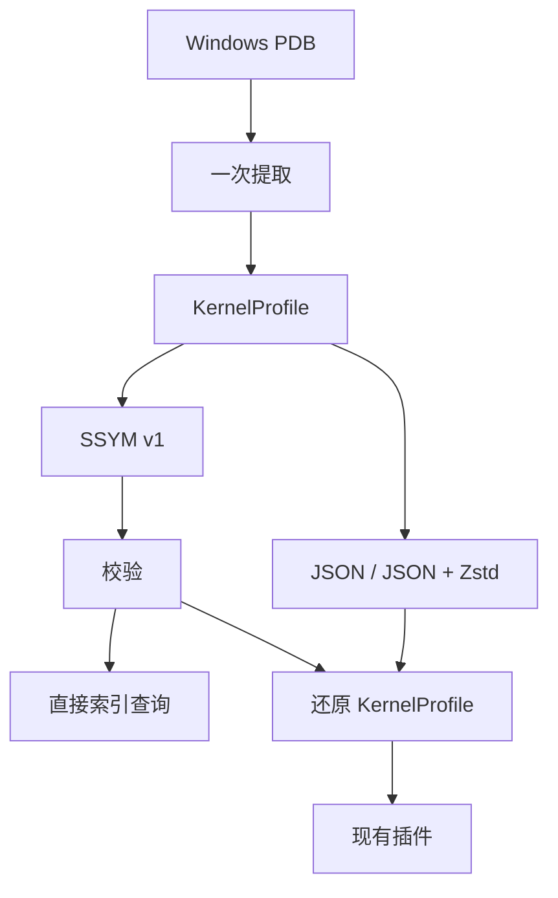

# SSYM：内存取证编译符号的格式与性能研究

**中文** · [English](README.en.md)

> **项目性质：StarMem 当前尚未公开源代码。本仓库仅用于 SSYM 格式的研究与验证，
> 不代表 StarMem 引擎源码发布，也不是可独立运行的 StarMem 产品或公开 SDK。**
> `reference/` 仅包含本次验证相关的源码片段与接入说明。读者可以审阅格式、工具和统计，
> 并离线核对发布数据；完整引擎实验仍需要已获得的私有源码或测试环境及有效授权。

## 摘要

SSYM（StarMem Symbols）研究如何将 Windows PDB 中的运行时符号信息一次提取，
保存为可验证、可索引的二进制文件，并在后续内存分析中复用。
本仓库包含实验格式、StarMem 参考实现片段、可复现的测量工具与原始统计，
用于回答“预编译、编码方式和运行时数据结构分别带来多少收益”。

当前 v1 无损保存 StarMem 的 `KernelProfile` 投影，采用定长记录、按名称排序的表、
去重字符串池和 SHA-256 校验。它是一个研究原型，尚未覆盖完整 ISF 类型图，
也未改变引擎默认符号路径。所有性能结论均限定到记录的实现、镜像和测量边界。

## 研究问题

| 编号 | 问题 | 对照方法 |
| --- | --- | --- |
| RQ1 | 预编译能否降低新会话的符号初始化成本？ | PDB 重新提取 vs 已生成的 JSON / SSYM |
| RQ2 | 在相同信息量下，二进制索引有什么收益与代价？ | 同一 profile 的加载、分配、体积与名称查询 |
| RQ3 | 阶段收益能否改善真实镜像分析？ | 同镜像 `AnalysisSession::open` + `pslist`，同时核对报告哈希 |
| RQ4 | 与完整 ISF 的差距是什么？ | 相同 PDB 的 Vol3 ISF 加载与原生 pslist，单独记录覆盖量和结果差异 |



图中的两条 SSYM 使用路径分别测量。当前实际 StarMem 会话使用“还原模型”路径，
直接索引的低分配结果不能当作所有插件已经获得的收益。
完整研究假设、对照条件和后续实验见 [研究设计](RESEARCH.md)。

## 实测摘要

实验日期：2026-10-05；三份 2 / 4 / 约 8 GiB Windows 镜像。
下表为热文件缓存下的符号加载中位数，单位 ms，每项 9 次。

| 方式 | A | B | C |
| --- | ---: | ---: | ---: |
| PDB 重新提取 | 4.548 | 13.800 | 13.691 |
| 同内容 JSON reader | 0.785 | 1.233 | 1.171 |
| SSYM 直接索引 | 0.386 | 0.593 | 0.691 |
| SSYM 兼容现有插件结构 | 0.628 | 1.384 | 0.877 |

SSYM 兼容加载比重复解析 PDB 快约 **7–16 倍**，但相对 JSON 并非稳定更快。
名称索引减少了分配，热查询却比已经构建好的 BTreeMap 慢。
实际会话中 A/B 的耗时范围重叠；C 的 PDB / JSON / SSYM 分别为
**23.980 / 10.090 / 11.033 ms**。当前证据支持继续研究预编译缓存与会话复用，
尚不支持宣称 SSYM 能普遍提升整次取证分析速度。

Vol3 的同源完整 ISF JSON 加载中位数为约 178–251 ms，但信息覆盖量和计时边界不同，
不能与上表直接计算格式加速比。其 pslist 在 A 返回零条、B 初始化失败、C 返回 161 条，
与 StarMem 的 160 条存在差异。StarMem A/C 自身也带完整性告警。
[基准报告](BENCHMARKS.md) 保留全部范围、失败和不等价结果。

## 文档导航

每份说明均提供完整的中文和英文版本；数据、代码标识符及原始诊断保持原样，便于复核。

| 内容 | 中文 | English |
| --- | --- | --- |
| 研究问题、设计取舍与实验路线 | [研究设计](RESEARCH.md) | [Research design](RESEARCH.en.md) |
| 文件头、记录布局、字符串与校验 | [格式规范](FORMAT.md) | [Format specification](FORMAT.en.md) |
| 同内容基准、真实会话与 Vol3 | [方法与结果](BENCHMARKS.md) | [Methods and results](BENCHMARKS.en.md) |
| 构建与复现实验 | [复现指南](REPRODUCE.md) | [Reproduction](REPRODUCE.en.md) |
| 已完成验证与覆盖边界 | [验证记录](VALIDATION.md) | [Validation record](VALIDATION.en.md) |
| 原始统计、单位与来源说明 | [数据说明](data/README.md) | [Data guide](data/README.en.md) |
| 命令脚本及运行顺序 | [工具说明](scripts/README.md) | [Tool guide](scripts/README.en.md) |
| 实测源码片段及接入补丁 | [参考实现](reference/README.md) | [Reference implementation](reference/README.en.md) |

## 复现与状态

发布包自身可以离线核对，不需要镜像或引擎授权。从本研究目录运行：

```powershell
python -B -X utf8 scripts/verify-study.py
```

重新执行引擎实验需要对应的 StarMem 私有源码或测试构建、有效的现有授权及研究者自备镜像。
`reference/` 是可审阅的源码片段，不是独立可构建 crate。
本仓库不包含原始镜像、PDB、完整符号文件、授权文件和恢复出的进程明细。
StarMem 源码和原始镜像均未随本仓库公开；样本哈希只用于身份核对，
因此不能仅从这个 Git 仓库完整复现引擎实验。

状态：**实验格式 v1 / 单机探索性基准 / Windows x64 内核投影**。
完整 ISF、Linux、其他模块 PDB、mmap 和插件字段句柄仍属于未来研究。

## 研究参考与许可

[Volatility 3 的符号加载实现](https://volatility3.readthedocs.io/en/latest/_modules/volatility3/framework/symbols/intermed.html)
提供 JSON 加载与校验路径；[LLVM PDB TPI/IPI 说明](https://llvm.org/docs/PDB/TpiStream.html)
描述以类型索引组织的调试记录。后续可在相同语义模型下比较
[FlatBuffers](https://flatbuffers.dev/) 和 [rkyv](https://rkyv.org/)，本次尚未测量这两种方案。

本研究发布包采用 **Apache-2.0**，见 [LICENSE-APACHE](LICENSE-APACHE)。
所附 StarMem 代码按其 Apache-2.0 许可选项分发。实测源码快照中的原始包元数据保留原样，
用于核对来源。Vol3 使用本地安装；本仓库不分发其源码或第三方符号数据。
