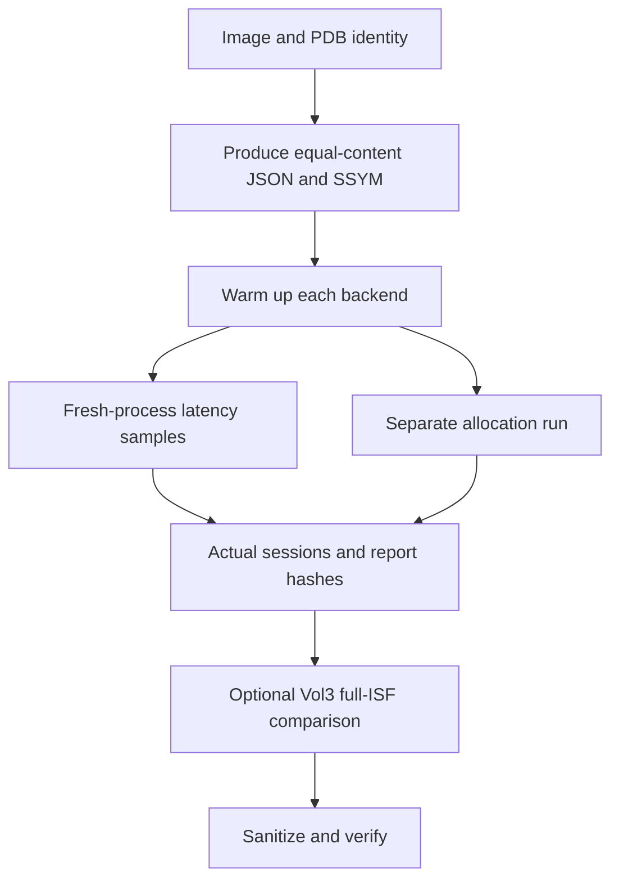

# Reproducing the Experiments

[中文](REPRODUCE.md) · **English** · [Project home](README.en.md)

## Experimental sequence



The diagram groups measurements by purpose, not by concurrent execution. All benchmarks still run
serially; consult commands.json for the precise invocation order.

## Environment and scope

**StarMem source is not public at present; this repository is an SSYM validation study only.**
The build and engine commands below are for researchers who already have the corresponding private
source or test environment. Downloading this repository permits format/source-excerpt review and
offline data checks, but does not provide enough source to build the complete StarMem engine.

The experiment uses the jointly developed StarMem 0.2.0 snapshot inside LovelyMem. Equal semantic
versions do not imply equal source. Use the build ID, source hashes, and Cargo.lock hash in `data/`.
`reference/` provides implementation excerpts and integration changes, not another standalone engine.

Researchers supply their own raw images. The script records their complete SHA-256 before read-only
analysis. A locally valid LovelyMem license is required; both the benchmark and native CLI retain
license checks. License failures stop the experiment and are not bypassed by changing the engine.

## Building StarMem

Run the following commands from the LovelyMem repository root. If this study is published separately,
replace `ssym-research/` with its absolute directory and point build commands to a complete StarMem
checkout with the SSYM changes integrated.

```powershell
cargo build --manifest-path src-tauri/vendor/starmem/Cargo.toml --locked --target-dir src-tauri/target --release --bin starmem --example symbol_format_bench
cargo test --manifest-path src-tauri/vendor/starmem/Cargo.toml --locked --target-dir src-tauri/target --release --lib profile::compiled
```

No Rust dependencies were added. Use the vendor lockfile rather than the host's separately resolved
dependencies. The CLI and benchmark call the same `build_eprocess_profile` and `AnalysisSession` implementations.

## Producing and using SSYM

```powershell
& 'src-tauri/target/release/starmem.exe' profile 'D:/symbols/ntkrnlmp.pdb/GUIDAGE/ntkrnlmp.pdb' -o 'D:/cases/kernel.ssym'
& 'src-tauri/target/release/starmem.exe' --json --threads 2 pslist 'E:/evidence/memory.raw' --profile 'D:/cases/kernel.ssym'
```

The `.ssym` extension explicitly selects binary output; other output extensions retain JSON.
Keep the input PDB: the prototype is not a complete archive of its debug information.
A changed recipe, failed integrity check, or mismatched target kernel requires regeneration or correct symbols.

## Equal-content StarMem benchmark

```powershell
python -B -X utf8 ssym-research/scripts/benchmark-starmem.py --exe src-tauri/target/release/examples/symbol_format_bench.exe --image 'E:/evidence/memory-a.raw' --image 'E:/evidence/memory-b.vmem' --output 'D:/cases/ssym-run-new' --repetitions 9 --session-repetitions 5
```

The output directory must be new. Use a different directory for repeated runs to avoid mixing builds,
recipes, or images. Repeat `--symbol-path` to supply existing PDB roots. When the exact PDB is missing,
the existing symbol download mechanism is used.

The script retains commands.json, individual loading/session samples, full pslist reports, and hashes
of inputs and outputs. Internal stage timings exclude startup, licensing, and report serialization;
command wall time is stored separately. Loading benchmarks exclude initial SSYM compilation;
the manifest separately records extraction and encoding costs.

Check that actual sessions reject corrupt files and wrong GUIDs with recomputed checksums:

```powershell
python -B -X utf8 ssym-research/scripts/check-ssym-rejection.py --exe src-tauri/target/release/starmem.exe --image 'E:/evidence/memory-a.raw' --ssym 'D:/cases/kernel.ssym' --output 'D:/cases/ssym-rejection-new'
```

## Volatility 3 comparison

Use an existing Vol3 Python environment. Vol3 format support does not need modification.

```powershell
python -B -X utf8 ssym-research/scripts/benchmark-vol3.py --starmem-results 'D:/cases/ssym-run-new/results.json' --output 'D:/cases/vol3-run-new' --repetitions 9 --session-repetitions 3
```

`--case 2` runs only the second image. `--timeout` limits each child process in seconds.
If optional Windows libmagic hangs on import, explicitly add `--without-libmagic`. This selects Vol3's
existing ImportError fallback only inside the test process and does not modify site-packages.

The sequence is: identical PDB SHA-256 → full ISF from Vol3 `PdbReader` → GUID/DBI Age check →
separate ISF loading test → native `windows.pslist.PsList`. Runs use offline mode, independent caches,
and serial analysis. Installed Windows kernel symbol collections are excluded while built-in PE and
other format definitions remain. Saved configurations are checked for selection of the generated ISF.

Loading requests schema validation and performs the first field/symbol query. First-invocation and
subsequent cached-validation samples are recorded separately. Python tracemalloc runs separately and
is not directly comparable to Rust counters as total memory. Vol3 pipeline timing has a different
boundary from StarMem internal session timing; no direct “SSYM versus Vol3” speedup is calculated.
Cross-engine comparison uses PID+EPROCESS sets only; report fields, detection policies, and completeness
semantics differ. Nonzero pslist exits are retained as failures, excluded from successful timing
statistics, and do not prevent testing subsequent images. Empty or differing sets are not marked
equivalent. Repeated successful runs on the same image must have identical record identities.
JSON always runs before XZ, so XZ's first call normally shares JSON's content validation cache and is
not directly comparable to a first JSON call without that cache.

## Publishing data

Published files use A/B/C identifiers, hashes, and statistics. Raw images, PDBs, full process reports,
and license material stay in local case directories. Read completeness, equivalence, and sample counts
alongside timings. Empty results are not automatically success, and short partial runs are not evidence
of more efficient equivalent analysis.

Export the implementation snapshot and sanitized measurements:

```powershell
python -B -X utf8 ssym-research/scripts/export-study.py --repository . --starmem-run 'D:/cases/ssym-run-new' --vol3-run 'D:/cases/vol3-run-new'
```

Optional `--environment` supplies a hardware environment JSON; `--rejection-results` supplies the
rejection test's results.json. Inspect paths, license, and file inventory after export.
`reference/` is a source excerpt, not a complete StarMem checkout or executable distribution.
Rebuilding requires the corresponding engine source. As raw images are undistributed, others can
repeat the method on their own images but cannot reproduce these exact evidence samples from this bundle alone.

Export updates measurements, reference source, and the Apache-2.0 license without overwriting authored
bilingual research documents. After source changes, recheck the tested build identity; pairing new
source with old samples must not be presented as the same experiment.

From the study directory, check the published bundle offline:

```powershell
python -B -X utf8 scripts/verify-study.py
```

Flow diagrams use Mermaid; byte layouts also have monospace text diagrams. For GitHub rendering, see
[Creating diagrams](https://docs.github.com/en/get-started/writing-on-github/working-with-advanced-formatting/creating-diagrams).
Keep `.md` and `.en.md` in sync, including every number, command, and status.
