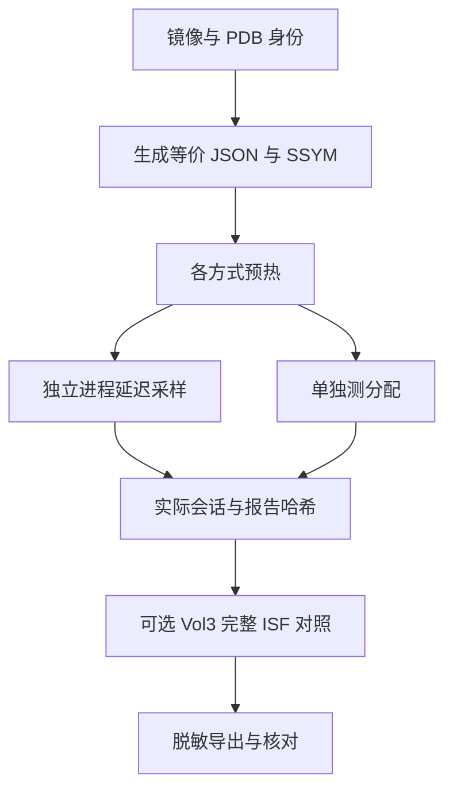

# 复现方法

**中文** · [English](REPRODUCE.en.md) · [项目首页](README.md)

## 实验顺序



图按测量目的分组，不表示并行执行。所有基准仍串行运行；具体调用顺序以 commands.json 为准。

## 环境与范围

**StarMem 当前尚未公开源代码，本仓库只做 SSYM 研究验证。**
下面的完整构建与引擎命令面向已获得对应私有源码或测试环境的研究者。
仅下载此仓库可审阅格式与参考片段、运行发布数据核对，不能直接构建完整 StarMem。

本实验基于 LovelyMem 内共同开发的 StarMem 0.2.0 源码快照。语义版本相同不表示
源码相同，应以 `data/` 中的 build ID、源码哈希、Cargo.lock 哈希为准。
`reference/` 提供本次实现及接入修改，不是另一个独立取证引擎。

原始镜像由研究者自行提供。脚本先记录完整 SHA-256，分析只读镜像。
需要本机可用的 LovelyMem 授权；测试程序和原生 CLI 都保留授权校验。
授权失败时停止，不通过修改引擎绕过。

## 构建 StarMem

以下命令在 LovelyMem 仓库根目录运行；本目录作为独立仓库发布时，
把 `ssym-research/` 替换为该目录的绝对路径，并指定已接入 SSYM 的 StarMem 源码位置。

```powershell
cargo build --manifest-path src-tauri/vendor/starmem/Cargo.toml --locked --target-dir src-tauri/target --release --bin starmem --example symbol_format_bench
cargo test --manifest-path src-tauri/vendor/starmem/Cargo.toml --locked --target-dir src-tauri/target --release --lib profile::compiled
```

未新增 Rust 依赖。使用供应商锁文件而不是宿主重新解析的依赖。
主程序与基准使用同一个 `build_eprocess_profile` 和 `AnalysisSession` 实现。

## 生成与使用 SSYM

```powershell
& 'src-tauri/target/release/starmem.exe' profile 'D:/symbols/ntkrnlmp.pdb/GUIDAGE/ntkrnlmp.pdb' -o 'D:/cases/kernel.ssym'
& 'src-tauri/target/release/starmem.exe' --json --threads 2 pslist 'E:/evidence/memory.raw' --profile 'D:/cases/kernel.ssym'
```

`.ssym` 显式选择二进制；其他输出扩展名继续为 JSON。
保存输入 PDB：原型不是调试信息的全量归档。
配方变化、文件校验失败或目标内核身份不匹配时需要重新生成/选择正确符号。

## 同内容 StarMem 基准

```powershell
python -B -X utf8 ssym-research/scripts/benchmark-starmem.py --exe src-tauri/target/release/examples/symbol_format_bench.exe --image 'E:/evidence/memory-a.raw' --image 'E:/evidence/memory-b.vmem' --output 'D:/cases/ssym-run-new' --repetitions 9 --session-repetitions 5
```

输出目录必须是新目录。重复运行请换一个目录，避免把不同构建/配方/镜像的产物混合。
`--symbol-path` 可重复指定已有 PDB 符号根；未找到精确 PDB 时使用原有符号下载逻辑。

脚本保留 `commands.json`、每次加载与会话样本、完整 pslist 报告、源文件和产物哈希。
内部阶段计时不含进程启动、授权、报告序列化；命令总墙钟时间单独保存。
加载基准不计入第一次编译 SSYM 的成本；manifest 另列 PDB 提取与二进制编码成本。

可独立复验真实会话会拒绝损坏文件和重新计算校验和的错误 GUID：

```powershell
python -B -X utf8 ssym-research/scripts/check-ssym-rejection.py --exe src-tauri/target/release/starmem.exe --image 'E:/evidence/memory-a.raw' --ssym 'D:/cases/kernel.ssym' --output 'D:/cases/ssym-rejection-new'
```

## Volatility 3 对照

使用已有 Vol3 Python 环境，不需要修改 Vol3 的格式支持。

```powershell
python -B -X utf8 ssym-research/scripts/benchmark-vol3.py --starmem-results 'D:/cases/ssym-run-new/results.json' --output 'D:/cases/vol3-run-new' --repetitions 9 --session-repetitions 3
```

`--case 2` 可只跑第二份镜像。`--timeout` 是每个子进程的秒数上限。
如果 Windows 的可选 libmagic 导入挂起，可显式增加 `--without-libmagic`。
这只在测试进程内触发 Vol3 原有的 ImportError 回退；不修改 site-packages。

流程为：同一 PDB SHA-256 → Vol3 `PdbReader` 生成完整 ISF → 核对 GUID/DBI Age →
单独测试 ISF 加载 → 原生 `windows.pslist.PsList`。
使用离线模式、独立 cache、串行分析，排除安装目录里的其他 Windows 内核符号集合，
保留内置 PE 等格式定义。每次核对保存的 config 确实选择本次生成的 ISF。

加载测试包括 schema 校验和首次字段/符号查询；第一次与后续校验缓存样本分别记录。
Python `tracemalloc` 单独运行，不能与 Rust 分配器计数直接当成总内存比较。
Vol3 的 CLI pipeline 耗时与 StarMem 内部阶段计时边界不同，不能直接计算“SSYM 快于 Vol3”的倍数。
跨引擎只比较 PID+EPROCESS 地址集合，报告字段、检测策略与完整性语义并不相同。
pslist 非零退出会被保存为失败，继续测试后续镜像，不纳入成功耗时统计。
零条或集合不同的结果也不会被标为等价；同一镜像多次成功运行的记录身份必须一致。
目前脚本固定先 JSON 后 XZ，因此 XZ 的首次调用通常已经共享 JSON 的内容校验缓存；
不能把它与无校验缓存的 JSON 首次调用直接比较。

## 发布数据

发布目录使用 A/B/C 样本标识、哈希和统计；原始镜像、PDB、完整进程报告及授权材料
放在本机 case 目录。阅读表格时同时检查完整性、结果等价与采样次数。
零条结果不自动代表成功；部分结果保留告警，不从耗时短推导效率更高。

生成可发布的实现快照和脱敏测量数据：

```powershell
python -B -X utf8 ssym-research/scripts/export-study.py --repository . --starmem-run 'D:/cases/ssym-run-new' --vol3-run 'D:/cases/vol3-run-new'
```

可选 `--environment` 指定硬件环境 JSON，`--rejection-results` 指定拒绝错误符号测试的 results.json。
导出后仍需检查路径、许可与产物清单。`reference/` 是源码片段，独立发布目录不包含完整 StarMem
或可执行程序；需要对应完整引擎源码才能重新构建。原始镜像不公开，因此其他研究者可以用自己的
镜像复跑方法，但不能仅凭本目录复现相同证据样本。

导出只更新测量数据、参考源码和 Apache-2.0 许可证，不覆盖手写的双语研究文档。
更新源码后必须重新确认 build ID 与实测来源一致，不能把新源码配上旧采样后称为同一实验。

从研究目录离线核对发布包：

```powershell
python -B -X utf8 scripts/verify-study.py
```

线图采用 Mermaid，字节布局同时提供等宽文本图。GitHub 的渲染方式见
[Creating diagrams](https://docs.github.com/en/get-started/writing-on-github/working-with-advanced-formatting/creating-diagrams)。
编辑时同步 `.md` 与 `.en.md`；所有数值、命令和状态应一致。
