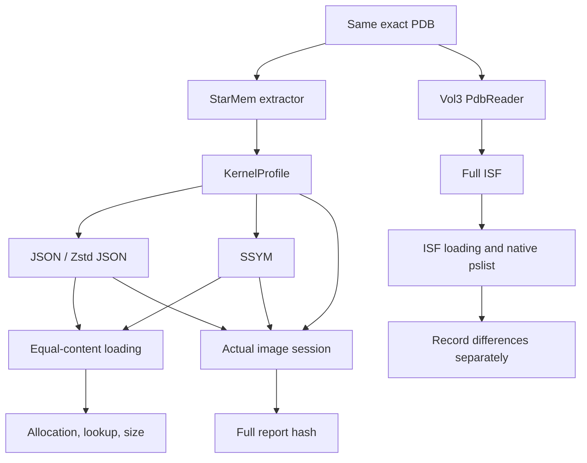
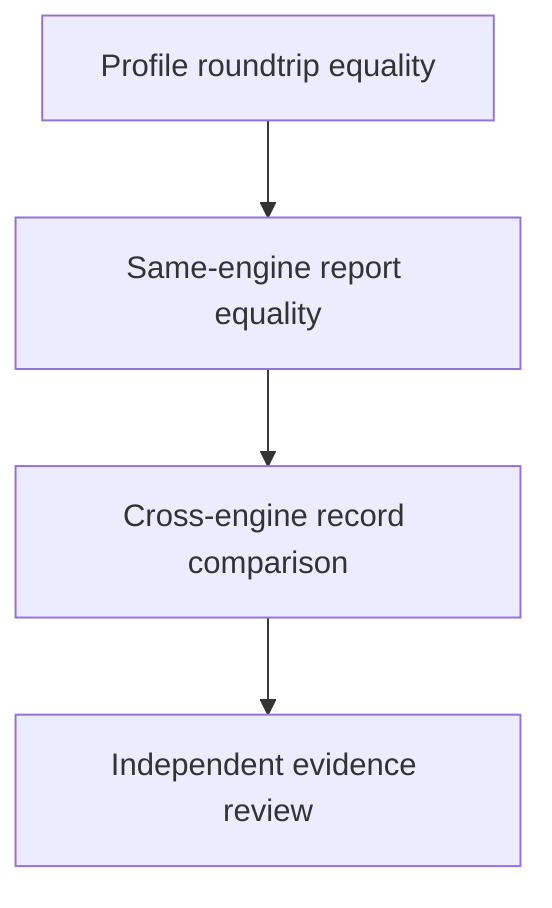

# Research Design: Separating Precompilation, Encoding, and Execution Cost

[中文](RESEARCH.md) · **English** · [Project home](README.en.md)

## Motivation and hypotheses

“Slow symbols” may mean PDB extraction, JSON decoding, validation, allocation, or name lookup.
It may also describe image reading and kernel discovery outside the symbol subsystem.
The study separates these costs before deciding whether a new format is worthwhile.
Mechanism explanations here are design inferences; numerical evidence is in the [benchmark report](BENCHMARKS.en.md).

| Question | Testable hypothesis | Required control | Current evidence |
| --- | --- | --- | --- |
| RQ1: precompilation | Persisting extraction results reduces repeated PDB parsing | Same PDB, extractor, and profile | Both SSYM and JSON reduce loading time |
| RQ2: encoding | Fixed records reduce parsing and allocation, but indexed queries may be slower | Full profile roundtrip equality; indexed and materialized paths measured separately | Fewer indexed allocations, slower hot lookup; materialization does not consistently beat JSON |
| RQ3: actual benefit | Initialization gains affect total time only if initialization is a sufficient fraction | Same image and plugin; identical full report hashes | A/B ranges overlap; precompilation helps C, with JSON having the lowest median |
| RQ4: generality | Projection results do not establish equivalent benefits for full ISF | Align type graphs, language, caches, and execution boundaries | Only an independent Vol3 comparison is complete, not general format equivalence |

## Three experimental paths



The first path fixes the semantic model to study representation. The second fixes the forensic task
to study practical benefit. The third records the cost and coverage of full ISF.
The third path cannot supply a direct format speedup for the first.

## Design tradeoffs

| Choice | Research purpose | Cost or limitation |
| --- | --- | --- |
| Fixed records and file-relative references | Avoid textual number parsing and expansion of an entire object tree | No full type graph; field widths depend on the format version |
| Sorted name tables with binary search | Name access without constructing a hash table at load time | String comparison and UTF-8 processing slow hot lookups |
| Deduplicated string pool | Reuse names and keep file references stable | Fixed records still consume space; compressed JSON can be smaller |
| Validated view | Centralize bounds, order, and corruption checks at entry | Opening reads and checks the whole file; it is not constant time |
| `to_profile()` compatibility boundary | Validate output through existing plugins | Reallocates strings and BTreeMaps, reducing the allocation advantage |
| Explicit `.ssym` input | Evaluate the format independently | No automatic production cache scheduler or cross-module migration yet |

The design supports a small, reviewable experiment. It does not establish superiority over mature
serialization systems. Comparisons with FlatBuffers, rkyv, or other candidates must use identical
fields, identity checks, and access patterns; those comparisons have not been performed.

## Cost model

This is a conceptual decomposition, not additional measured data:

```text
T_session = T_image_and_bootstrap + T_symbol_initialization + T_plugin

T_ssym_indexed = T_read + T_integrity_and_structure_checks
T_ssym_compatible = T_ssym_indexed + T_materialize_profile
T_repeated_pdb = T_read_pdb + T_extract_profile
```

Let `p` be the fraction of original session time spent in the initialization stage being optimized,
and `s` its local speedup. With all other costs unchanged, overall speedup is conceptually
`1 / ((1 - p) + p / s)`. This study does not estimate `p` by mixing measurements with different
boundaries. Session reuse, additional identity checks, and caches change the costs, making actual
session measurements more persuasive than a local speedup alone.

## Equivalence and evidence



Each step requires additional evidence. Passing one does not establish the next.
Matching profile hashes show preservation of the current model. Matching full report hashes show
equal output for this execution. Even matching PID+EPROCESS sets do not prove every field correct
or every process discovered. Partial A/C results and Vol3 differences remain visible.

## Threats to validity

- **Internal validity:** one machine, no fixed CPU frequency or affinity, and high outliers. All samples and ranges are retained; allocation counting runs separately from latency measurements.
- **Construct validity:** Rust requested heap and Python tracemalloc are not RSS; name queries are not plugin workloads; engine timing boundaries, type coverage, and threading differ.
- **External validity:** only three undistributed Windows images, the kernel projection, and pslist; no cold-cache or multi-machine experiments.
- **Reproducibility:** the parent commit does not identify the measured working tree with pre-existing changes. Build IDs, source hashes, and commands are retained, but raw images and complete engine source are not included.

## Further work and acceptance criteria

| Direction | Proposed experiment | Acceptance criterion |
| --- | --- | --- |
| Exact-identity compiled cache | PDB hash, GUID, DBI Age, recipe, and format version as identity; concurrent writes and stale caches | Incorrect identities always rejected; repeated new sessions cost less |
| Plugin field handles | Resolve names at initialization and reuse indices or offsets in hot paths | Equal output; improved complete plugin latency; lookup is no longer a regression |
| Larger symbol storage | Preallocation or mmap; measure validation cost, actual RSS, and file lifetime | Lower peak resources or startup cost at equal validation strength |
| Full ISF type graph | Enums, pointers, arrays, aliases, functions, and module references; compare other formats | Lossless information roundtrip and passing public compatibility samples |
| Broader experiments | Distributable images, more versions, multiple machines, cold caches, and sequential plugins | Publish samples and failures; findings can be checked within a declared scope |

These are research proposals. Unimplemented capabilities are not v1 format guarantees or measured
results. New experiments should include input identities, raw samples, measurement boundaries,
completeness status, and every failure, with matching Chinese and English documentation.
