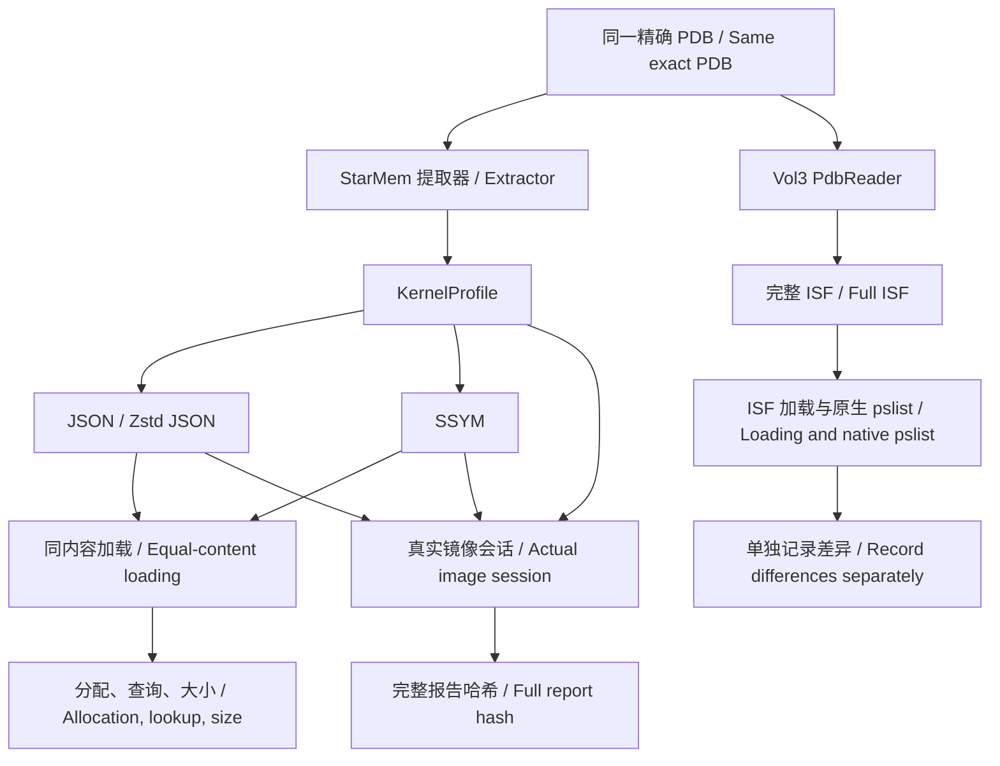
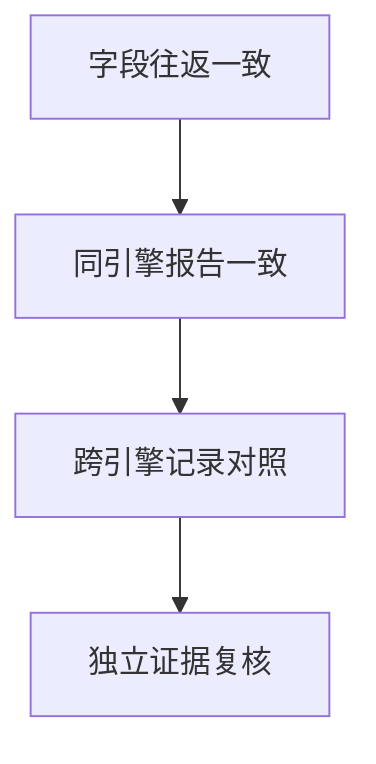

# 研究设计：分离预编译、存储编码与执行成本

**中文** · [English](RESEARCH.en.md) · [项目首页](README.md)

## 动机与假设

“符号表慢”可能指 PDB 类型提取、JSON 解码、校验、对象分配、名称查询，
也可能指符号之外的镜像读取与内核引导。研究首先分离这些成本，再判断是否值得改变文件格式。
本文的机制解释是设计推断，数值证据见 [基准报告](BENCHMARKS.md)。

| 问题 | 可检验假设 | 必要对照 | 当前证据 |
| --- | --- | --- | --- |
| RQ1：预编译 | 保存提取结果可减少重复 PDB 解析 | 相同 PDB、提取器和 profile | SSYM 与 JSON 均降低加载时间 |
| RQ2：编码 | 定长记录可降低解析与分配，但索引查询可能更慢 | profile 完整往返等价；分别测索引与还原结构 | 索引低分配、热查询较慢；兼容路径未稳定胜过 JSON |
| RQ3：实际收益 | 初始化占比足够大时，局部收益才能改善总耗时 | 同镜像、同插件、完整报告哈希一致 | A/B 范围重叠；C 的预编译有收益且 JSON 中位数最低 |
| RQ4：通用性 | 运行时投影的收益不能直接推广到完整 ISF | 对齐类型图、语言、缓存和执行边界 | 仅完成独立 Vol3 对照，未完成通用格式等价实验 |

## 三条实验路线



第一条路线固定语义模型，研究表示方式；第二条固定取证任务，研究实际收益；
第三条记录完整 ISF 的成本与覆盖差距。第三条路线不能为第一条提供直接加速比。

## 设计取舍

| 设计 | 研究目的 | 已知代价或边界 |
| --- | --- | --- |
| 定长表 + 文件相对引用 | 避免文本数值解析和整棵对象树展开 | 不实现完整类型图；字段宽度与版本绑定 |
| 排序名称表 + 二分查找 | 无需加载时重建哈希表即可按名称访问 | 字符串比较与 UTF-8 处理使热查询变慢 |
| 去重字符串池 | 重用重复名称，保持文件内引用稳定 | 固定记录仍占空间；不保证比压缩 JSON 小 |
| 完整校验后提供视图 | 将范围、排序与损坏检测集中到入口 | 打开需读取并校验整份文件，不是常数时间 |
| `to_profile()` 兼容边界 | 用现有插件验证结果 | 再次分配字符串与 BTreeMap，削弱低分配优势 |
| 显式 `.ssym` 入口 | 独立评估格式 | 尚无自动生产缓存调度或跨模块迁移 |

此设计服务于小规模、可审阅的实验，不证明自定义格式优于成熟序列化方案。
与 FlatBuffers、rkyv 等候选比较时，必须保持相同字段、身份校验和访问模式；目前未开展。

## 成本模型

以下是概念分解，不是额外测量结果：

```text
T_session = T_image_and_bootstrap + T_symbol_initialization + T_plugin

T_ssym_indexed = T_read + T_integrity_and_structure_checks
T_ssym_compatible = T_ssym_indexed + T_materialize_profile
T_repeated_pdb = T_read_pdb + T_extract_profile
```

将原会话中可优化的初始化占比记为 `p`，局部加速比记为 `s`，假设其他成本不变，
则概念上的整体加速比为 `1 / ((1 - p) + p / s)`。
本次没有用不同边界的微基准强行估计 `p`。会话复用、额外身份校验和缓存状态会改变成本，
因此实际会话测量比局部倍数更有说服力。

## 等价性与证据边界



每一步需要额外证据，前一步通过不会自动证明后一步。
profile 哈希相同证明当前模型未在转换中丢失；完整报告哈希相同证明本次执行输出一致；
PID+EPROCESS 集合相同仍不能证明所有字段正确或所有进程都被发现。
本次 A/C 的部分结果与 Vol3 差异均保留。

## 有效性威胁

- **内部有效性：**单机、未固定 CPU 频率或亲和性、存在较高离群值；保留全部样本和范围，分配统计与延迟分开运行。
- **构念有效性：**Rust 请求堆与 Python tracemalloc 都不是 RSS；名称查询不等于插件负载；跨引擎计时、类型覆盖和线程策略不同。
- **外部有效性：**仅三份未公开 Windows 镜像、内核投影与 pslist；没有冷缓存或多机测试。
- **可复现性：**父 commit 不能代表含既有修改的实测工作树；保留 build ID、源码哈希和命令，但发布包不包含原始镜像与完整引擎源码。

## 后续研究与验收条件

| 方向 | 待实施实验 | 成功判据 |
| --- | --- | --- |
| 精确身份的编译缓存 | PDB 哈希、GUID、DBI Age、配方与格式版本组成缓存身份；测并发写入和陈旧缓存 | 错误身份始终拒绝；多次新会话实际成本下降 |
| 插件字段句柄 | 初始化时解析名称，插件热路径复用索引或偏移 | 输出等价；完整插件耗时改善；查询不再成为回退项 |
| 大型符号存储 | 预分配或 mmap；测验证成本、实际 RSS 和文件生命周期 | 相同校验强度下减少峰值资源或启动成本 |
| 完整 ISF 类型图 | 枚举、指针、数组、别名、函数和模块引用；与其他格式对照 | 信息往返等价，公开兼容样本通过 |
| 扩展实验集 | 可分发镜像、更多版本、多机器、冷缓存及连续插件链 | 公开采样和失败；结论在预先声明的范围内可复核 |

这些是研究计划，未实现功能不属于 v1 格式承诺或实测结果。
提交实验时请保留输入身份、原始样本、计时边界、完整性状态和全部失败，并同步中英文说明。
